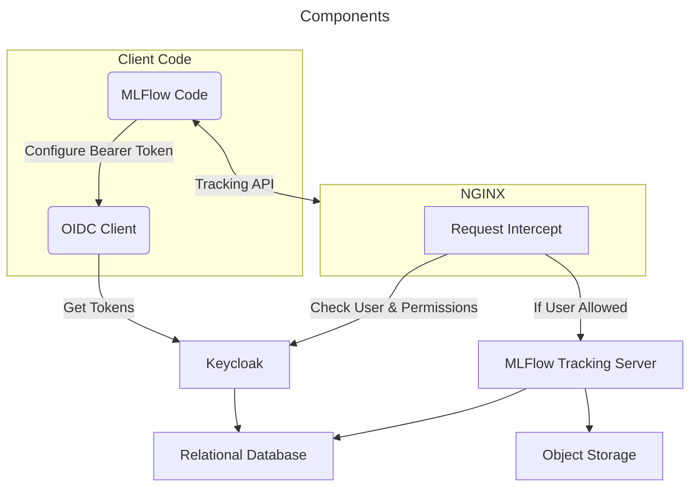

# MLFlow Tracking server with OIDC Auth

This repository contains an experimental template for a remote [MLFlow Tracking Server](https://mlflow.org/docs/latest/ml/tracking/server/) with support for [OpenID Connect (OIDC)](https://openid.net/developers/how-connect-works/) and [User-Managed Access (UMA)](https://docs.kantarainitiative.org/uma/wg/rec-oauth-uma-grant-2.0.html). 

## Rationale

When a MLFlow Tracking server must be exposed through the internet, security measures must be taken to restrict access, and control permissions when dealing with multiple users. The built-in support for authentication is [experimental](https://mlflow.org/docs/latest/ml/auth/), and currently lacks some desirable control policies. As such, this repository is an experimental template using Keycloak and NGINX, to provide enhanced capabilities for user management, and remote access to a self-hosted MLFlow tracking server.

## Quickstart

### System Requirements

- `Docker` and `docker-compose`;
- Python 3.10+ (local execution);

### 1. Setting Up the Infrastructure

1. The first step is to start all the servers running `docker-compose up`;
2. Once everything is up and running, you should be able to access the following services:
    - MinIO at http://localhost:9001 (user: `root`, password: `rootroot`);
    - Keycloak at http://localhost:8083 (user: `admin`, password: `admin`);
    - NGINX proxy to MLFlow tracking server at http://localhost:8000 (the browser should indicate a `400 Bad Request`);  
3. The next step is to define a sample user in [Keycloak](https://www.keycloak.org/docs/latest/server_admin/index.html#assembly-managing-users_server_administration_guide): the user should be on the realm `mlflow` and must have a role mapping for either `Default` or `Admin`;
    - The `mlflow` realm comes pre-configured with roles, permissions and resources, you might want to take a deeper look into the realm configuration;
    - As a quick note, `Admin` users are allowed to the delete endpoints of MLFlow, while the others are not;
    - When a `Default` user tries to run a delete operation, the server returns a `403 Forbidden`;

### 2. Running Locally

1. Once you have at least a user defined in the `mlflow` realm on Keycloak, you should be able to access the MLFlow tracking server UI and run experiments;
2. Start by installing the requirements with your preferred manager (e.g., `uv pip install -r requirements.txt`);
    - It is advisable to create a [virtual environment](https://docs.python.org/3/library/venv.html) instead of installing packages system-wide;
3. Once everything is installed, access the MLFlow interface by running `python -m mlflow_app.ui`;
    - You will be prompted to enter you username and password defined on Keycloak;
    - The interface will be available at http://localhost:5000;
    - The [mlflow_app.ui](./mlflow_app/ui.py) creates a simple local proxy using `FastAPI` which takes care of sending your user credentials to NGINX;
    - The OIDC client has created a `credentials.json` file which contains your tokens. This information is sensitive and should be stored carefully;
4. Now that you can access the MLFlow UI using a secure token, you can run a sample experiment with `python -m mlflow_app.sample`;
    - The code should run quite fast;
    - You should note that the sample uses the [`auto_refresh.TokenAutoRefresh`](./mlflow_app/auto_refresh.py) context manager, which takes care of updating the OIDC tokens alongside the run (otherwise run duration would be limited to the access token lifetime);

## Deployment Considerations

> [!WARNING]  
> The sample code and architecture shouldn't be deployed in any testing/production environment. Additional measures and configuration are necessary. This template could be used as a starting point.

The following non-exhaustive list contains some considerations beyond the template setup which must be addressed if you plan on deploying a similar architecture:

1. Use HTTPS and configure both Keycloak and NGINX with SSL certificates;
    - The sample simplifies this process by forcing HTTP (non-secure);
2. Use PKCE on OIDC client;
    - The sample has a simplified OIDC client/RP implementation which doesn't use PKCE, and only provides the Authorization Code Flow;
3. Validate JWTs and use JWKS;
    - The sample OIDC client doesn't perform any validation on the returned tokens;
4. To access the MLFlow UI in this architecture each end-user is required to run a local proxy which sets the appropriate authorization headers;
    - This might be a hardship to setup, and debug across platforms;
5. MLFlow doesn't have a built-in notion of user;
    - MLFlow has a `User` tag that reads the current user from the system;
    - If the OIDC user is also important to be logged, the [`mlflow_app.utils.set_oidc_user`](./mlflow_app/utils.py) should be called on the beginning of each run (see the samples);
    - In any case, this only logs the user for the run and can be easily changed;
    - It is more robust that either NGINX or Keycloak log user actions (e.g., endpoint calls, authorization requests);
6. Maintenance is required to keep this setup updated and running;
    - The architecture uses multiple proxies (i.e., NGINX, local proxy) and custom libraries (e.g., OIDC client) to make everything work;
    - If MLFlow or any of the dependencies change, additional work is required and each end-user must update their library;
    - A much simpler architecture would be to use a SSH tunnel to directly access the MLFlow server;
        - However, an identity-aware proxy would still be required to provide access control;
7. Multiprocessing and multithreading safety;
    - The OIDC client isn't inherently thread-safe and depends on Python's GIL;

## Architecture

The diagram below gives an overview of the architecture. 

- `Client Code`: refers to the code that interacts with the remote MLFlow server;
    - [`MLFlow Code`](./mlflow_app): code that interacts with the `mlflow` API (e.g., Python, Scala, etc);
    - [`OIDC Client`](./oidc_client): small library that allows user to login to an Identity Provider (e.g., Keycloak);
- [`Keycloak`](./keycloak): identity provider;
- [`NGINX`](./nginx): identity-aware reverse proxy;
    - [`Request Intercept`](./nginx/scripts/intercept.js): module that provides the "identity-aware" capability (i.e., checks with the Identity Provider whether the user is valid and has sufficient permission to the resource);
- [`MLFlow Tracking Server`](./mlflow-server): remote tracking server;
- `Object Storage`: remote object storage for models, artifacts, etc;
- `Relational Database`: database for MLFlow (e.g., experiments, run, metadata) and Keycloak (e.g., realms, users, tokens);

## Alternatives

- [mlflow-oidc-auth](https://github.com/mlflow-oidc/mlflow-oidc-auth): MLFlow auth plugin to use OpenID Connect (OIDC) as authentication and authorization provider;

